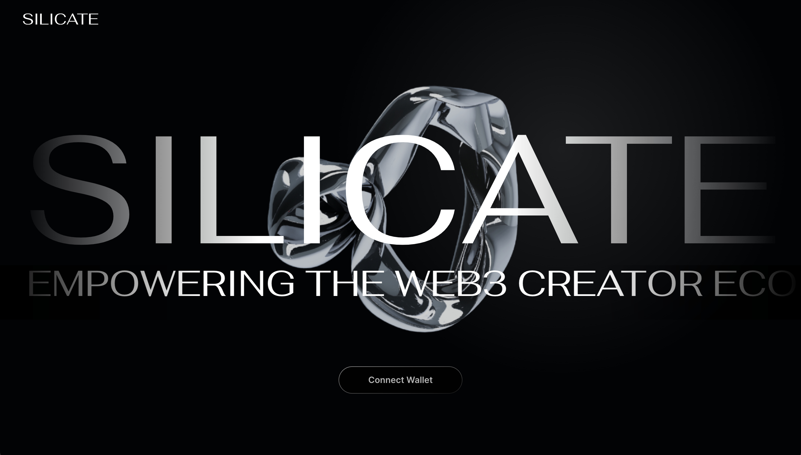

# Silicate: Mantle Network Native NFT Minting Platform

This project was built specifically for the 2023 Mantle Mash Hackathon.

- Watch the demo video: https://vimeo.com/801346926
- Check out the deployed live demo: https://silicate.dev

## Introduction

> The rocks that make up Earth’s ***mantle*** are mostly ***silicates*** — a wide variety of compounds that share a silicon and oxygen structure, National Geographic ([source](https://education.nationalgeographic.org/resource/mantle/))

_Like the scientific fact quoted above, we believe Silicate can help onboard the next-generation, tokenized creator economy on Mantle Network._

Silicate is a no-code NFT minting platform built for the Mantle Network. 

## Problem Statement
In a blockchain-powered creative economy, it’s extremely empowering for creators to be able to tokenize their content. This allows them to accrue value from their work on-chain - whether that be artworks, in-game-assets, or community memberships.

However, it’s no surprise that creators without technical knowledge have a hard time figuring out how to get involved in this new token economy, especially in a newer ecosystem like Mantle Network.

This is why we’ve built Silicate. Silicate is a Mantle Network native platform that provides the easiest experience for anyone to deploy NFTs with no-code and no-fees onto the Mantle Network.

### Architecture Diagram

### Tech Stack

- Mantle Testnet
- NextJS
- Express
- Firebase
- Ethers
- Hardhat
- wagmi hooks
- IPFS (web3.storage)

### Next Steps

- Add more interactive features such as Explore and Profile pages
- Replace NFT metadata caching with Mantle NFT indexer when available / built in-house
- Add support for soul-bound tokens / on-chain credentials
- Add more sophisticated NFT mint/burn mechanisms for advanced users
- Add additional media assets such as 3D models, videos, code, etc.
- Add testing and monitoring for reliability
